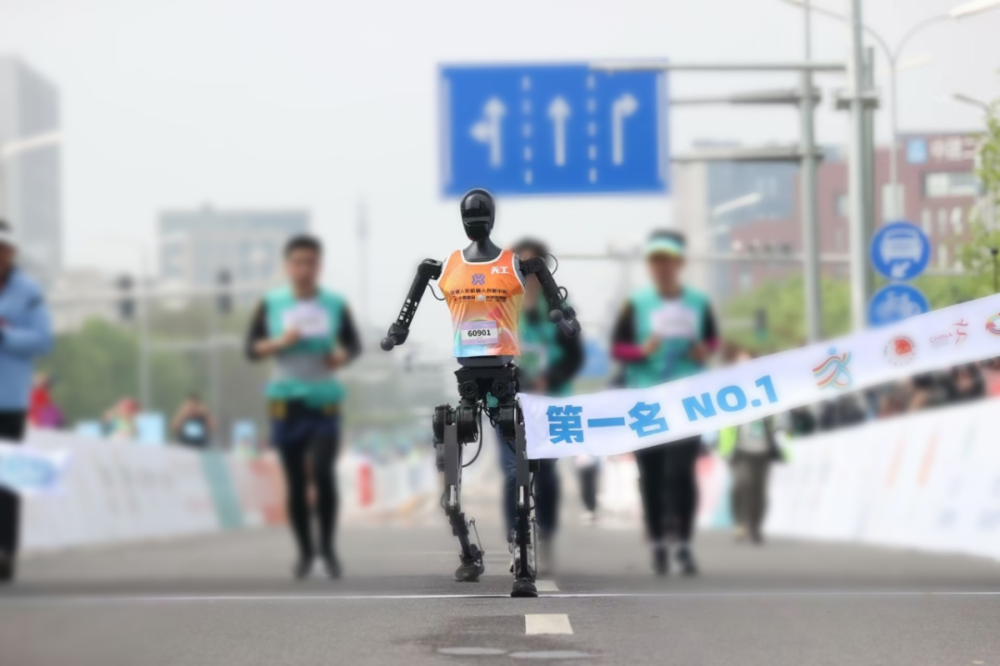

# TienKung-Lab: Direct IsaacLab Workflow for TienKung

[](https://docs.omniverse.nvidia.com/isaacsim/latest/overview.html)
[](https://isaac-sim.github.io/IsaacLab)
[](https://github.com/leggedrobotics/rsl_rl)
[](https://docs.python.org/3/whatsnew/3.10.html)
[](https://releases.ubuntu.com/22.04/)
[](https://opensource.org/licenses/BSD-3-Clause)
[](https://pre-commit.com/)

<div align="center">
  
  <br>
  <b><span style="font-size:1.2em;">TienKung humanoid robot won the championship in the first Humanoid Robot Half Marathon</span></b>
  <br>
</div>


## Overview

| Motion |              AMP Animation               |                     Sensors                      |                   RL + AMP                    |                   Sim2Sim                   |
| :----: | :--------------------------------------: | :----------------------------------------------: | :-------------------------------------------: | :-----------------------------------------: |
|  Walk  |  |  |  |  |
|  Run   |   |   |   |   |

This framework is an RL-based locomotion control system designed for full-sized humanoid robots, TienKung. It integrates AMP-style rewards with periodic gait rewards, facilitating natural, stable, and efficient walking and running behaviors.

The codebase is built on IsaacLab, supports Sim2Sim transfer to MuJoCo, and features a modular architecture for seamless customization and extension. Additionally, it incorporates ray-casting-based sensors for enhanced perception, enabling precise environmental interaction and obstacle avoidance. The framework has also been successfully validated on the real TienKung robot.

## TODO List
- [x] Motion retargeting support 2025-09-27
- [x] Add sim2real demo 2025-11-07
- [x] Add a hyperlink to the deployment [repository](https://github.com/Open-X-Humanoid/Deploy_Tienkung.git) 2025-11-19
- [ ] Add more sensors
- [ ] Add Perceptive Control

## Installation
TienKung-Lab is built with IsaacSim 4.5.0 and IsaacLab 2.1.0.

- Install Isaac Lab by following the [installation guide](https://isaac-sim.github.io/IsaacLab/main/source/setup/installation/index.html). We recommend using the conda installation as it simplifies calling Python scripts from the terminal.

- Clone this repository separately from the Isaac Lab installation (i.e. outside the `IsaacLab` directory)

- Using a python interpreter that has Isaac Lab installed, install the library

```bash
cd TienKung-Lab
pip install -e .
```
- Install the rsl-rl library

```bash
cd TienKung-Lab/rsl_rl
pip install -e .
```

- Verify that the extension is correctly installed by running the following command:

```bash
python legged_lab/scripts/train.py --task=walk  --logger=tensorboard --headless --num_envs=64
```

## Usage

### Motion Retargeting

| AMASS  |  GMR               |                     TIENKUNGLAB                      | 
| :----: | :--------------------------------------: | :----------------------------------------------: | 
|    |  |  | 

This section uses [GMR](https://github.com/YanjieZe/GMR) for motion retargeting, Tienkung currently supports motion retargeting only for SMPLX types (AMASS, OMOMO).

**1. Prepare the dataset and Motion retargeting with [GMR](https://github.com/YanjieZe/GMR).**
```bash
python scripts/smplx_to_robot.py --smplx_file <path_to_smplx_data> --robot tienkung  --save_path <path_to_save_robot_data.pkl>
```
**2. Data Processing and Data Saving.**

The dataset consists of two parts with distinct functions and formats, requiring conversion in two steps.

- **`motion_visualization/`**  
  Used for motion playback with `play_amp_animation.py` to check motion correctness and quality.  
  Data fields:  [root_pos, root_rot, dof_pos, root_lin_vel, root_ang_vel, dof_vel]

- **`motion_amp_expert/`**  
  Used during training as expert reference data for AMP.  
  Data fields:  [dof_pos, dof_vel, end-effector pos]
  
- **Step 1: Data Processing and Visualization Data Saving.**

```bash
python legged_lab/scripts/gmr_data_conversion.py --input_pkl <path_to_save_robot_data.pkl> --output_txt legged_lab/envs/tienkung/datasets/motion_visualization/motion.txt
```

**Note**: Before starting step 2, set the `amp_motion_files_display` path in the config to the file generated in step 1.

- **Step 2: Motion Visualization and Expert Data Saving.**
```bash
python legged_lab/scripts/play_amp_animation.py --task=walk --num_envs=1 --save_path legged_lab/envs/tienkung/datasets/motion_amp_expert/motion.txt --fps 30.0
```
**Note**: After step 2, set the `amp_motion_files` path in the config to the file generated in step 2.

### Visualize motion

Visualize the motion by updating the simulation with data from tienkung/datasets/motion_visualization.

```bash
python legged_lab/scripts/play_amp_animation.py --task=walk --num_envs=1
python legged_lab/scripts/play_amp_animation.py --task=run --num_envs=1
```

### Visualize motion with sensors

Visualize the motion with sensors by updating the simulation with data from tienkung/datasets/motion_visualization.

```bash
python legged_lab/scripts/play_amp_animation.py --task=walk_with_sensor --num_envs=1
python legged_lab/scripts/play_amp_animation.py --task=run_with_sensor --num_envs=1
```

### Train

Train the policy using AMP expert data from tienkung/datasets/motion_amp_expert.

```bash
python legged_lab/scripts/train.py --task=walk --headless --logger=tensorboard --num_envs=4096
python legged_lab/scripts/train.py --task=run --headless --logger=tensorboard --num_envs=4096
```

### Play

Run the trained policy.

```bash
python legged_lab/scripts/play.py --task=walk --num_envs=1
python legged_lab/scripts/play.py --task=run --num_envs=1
```

### Sim2Sim(MuJoCo)

Evaluate the trained policy in MuJoCo to perform cross-simulation validation.

Exported_policy/ contains pretrained policies provided by the project. When using the play script, trained policy is exported automatically and saved to path like logs/run/[timestamp]/exported/policy.pt.
```bash
python legged_lab/scripts/sim2sim.py --task walk --policy Exported_policy/walk.pt --duration 100
```

### Sim2Real
The results of the TienKung-Lab have been successfully verified on the real **TienKung** robot.

For deployment details, refer to the repository [here](https://github.com/Open-X-Humanoid/Deploy_Tienkung.git).

**Safety Notice:** Testing on real robot is risky. RL policy may cause unexpected or violent motions, so ensure accident insurance is in place and the emergency stop works.

<p align="center">
  
</p>

## Code formatting

We have a pre-commit template to automatically format your code.
To install pre-commit:

```bash
pip install pre-commit
```

Then you can run pre-commit with:

```bash
pre-commit run --all-files
```

## Troubleshooting

### Pylance Missing Indexing of Extensions

In some VsCode versions, the indexing of part of the extensions is missing. In this case, add the path to your extension in `.vscode/settings.json` under the key `"python.analysis.extraPaths"`.

```json
{
    "python.analysis.extraPaths": [
        "${workspaceFolder}/legged_lab",
        "<path-to-IsaacLab>/source/isaaclab_tasks",
        "<path-to-IsaacLab>/source/isaaclab_mimic",
        "<path-to-IsaacLab>/source/extensions",
        "<path-to-IsaacLab>/source/isaaclab_assets",
        "<path-to-IsaacLab>/source/isaaclab_rl",
        "<path-to-IsaacLab>/source/isaaclab",
    ]
}
```

## Acknowledgement
* [GMR](https://github.com/YanjieZe/GMR):General Motion Retargeting.
* [Legged Lab](https://github.com/Hellod035/LeggedLab): a direct IsaacLab Workflow for Legged Robots.
* [Humanoid-Gym](https://github.com/roboterax/humanoid-gym):a reinforcement learning (RL) framework based on NVIDIA Isaac Gym, with Sim2Sim support.
* [RSL RL](https://github.com/leggedrobotics/rsl_rl): a fast and simple implementation of RL algorithms.
* [AMP_for_hardware](https://github.com/Alescontrela/AMP_for_hardware?tab=readme-ov-file): codebase for learning skills from short reference motions using Adversarial Motion Priors.
* [Omni-Perception](https://acodedog.github.io/OmniPerceptionPages/): a perception library for legged robots, which provides a set of sensors and perception algorithms.
* [Warp](https://github.com/NVIDIA/warp): a Python framework for writing high-performance simulation and graphics code.

## Discussions
If you're interested in TienKung-Lab, welcome to join our WeChat group for discussions.


